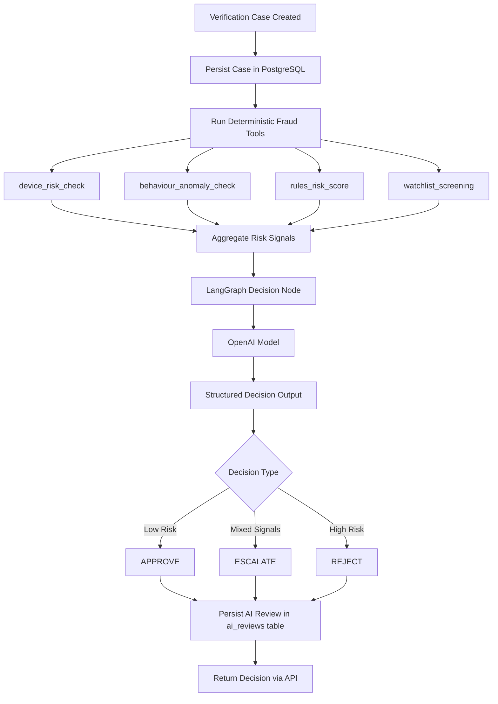
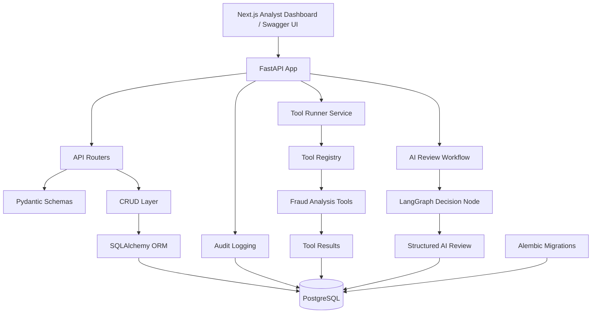

# AI Verification Copilot

**AI Verification Copilot** is a production-style internal fraud triage and decisioning system designed to simulate the type of tooling used by identity verification, fraud operations, and trust & safety teams to review potentially suspicious verification cases.

This project is intentionally designed to demonstrate **AI systems engineering patterns rather than simple model prompting**. It is being built as a full-stack engineering portfolio piece with a strong focus on backend systems, structured tool execution, agent-based orchestration, human-in-the-loop workflows, auditability, persistence, explainability, and evaluation discipline.

The goal is not just to call a model, but to build something that feels like a realistic internal analyst tool:

- verification cases are persisted
- deterministic fraud tools run against those cases
- AI review outputs are structured and persisted
- audit history is captured
- the frontend behaves like an internal review console
- the system can later support evaluation, benchmarking, and human override workflows

The current implementation includes:

- a working FastAPI backend
- PostgreSQL persistence
- SQLAlchemy ORM models
- Alembic migrations
- paginated case APIs
- structured audit logging
- deterministic fraud tooling with parallel execution
- LangGraph-based AI orchestration
- structured AI decision persistence
- a working Next.js frontend dashboard
- persisted tool result retrieval
- persisted AI review retrieval
- audit timeline rendering in the frontend
- a human override placeholder workflow
- reproducible demo cases covering `APPROVE`, `ESCALATE`, and `REJECT`

---

## Backend Architecture

The backend is designed using a layered architecture so that each part of the system remains independently understandable, testable, and extensible.

### **API Layer**

FastAPI provides the HTTP interface and automatic OpenAPI documentation.

### **Schema Layer**

Pydantic models define request validation and response serialisation.

### **CRUD Layer**

Database access is separated into CRUD functions to keep route handlers thin and maintainable.

### **Persistence Layer**

SQLAlchemy ORM maps Python models to PostgreSQL tables.

### **Migration Layer**

Alembic manages database schema evolution through version-controlled migrations.

### **Audit Layer**

Audit events are written to `audit_logs` to capture backend actions, metadata, and latency.

### **Tool Execution Layer**

Deterministic fraud tools execute against structured case data and return standardised tool outputs.

### **AI Review Layer**

A LangGraph-based orchestration flow aggregates tool signals and produces structured AI review outputs that are validated and persisted.

---

## Frontend Dashboard

The project now includes a working internal-style analyst dashboard built with **Next.js**, **TypeScript**, and **Tailwind CSS**.

The frontend is designed to simulate a realistic internal review console where an analyst can:

- browse verification cases
- open a case detail page
- inspect structured case data
- run deterministic fraud tools
- run an AI review
- inspect explainability and aggregated signals
- view audit history
- see a human override placeholder workflow

### **Current frontend routes**

- `/cases` — verification case queue
- `/cases/[id]` — case detail page

### **Current frontend capabilities**

- paginated queue view
- search / filter on queue
- refresh action
- rows-per-page selector
- internal-tool styling
- case metadata rendering
- device info / document check / behaviour summary panels
- deterministic tool results panel
- AI review panel
- audit timeline panel
- human override placeholder panel
- persisted operational state loading on refresh

---

## System Workflow

The current system processes verification cases using the following workflow:

1. A verification case is created through the API.
2. The case is persisted in PostgreSQL.
3. Deterministic fraud analysis tools execute in parallel.
4. Each tool returns structured risk signals.
5. Tool results are stored in the `tool_runs` table.
6. Aggregated signals are passed into a LangGraph-based AI decision workflow.
7. The AI decision node produces a structured outcome (`APPROVE`, `ESCALATE`, or `REJECT`).
8. The result is persisted to the `ai_reviews` table and returned via the API.
9. Audit events are written for important workflow actions.
10. The frontend dashboard can reload the latest persisted tool results and latest persisted AI review for a case.
11. Audit history can be viewed in the case detail screen.

This workflow mirrors the structure of internal trust & safety and identity verification systems, where deterministic checks and model-assisted review work together.

---

## Data Model

### **`cases`**

Represents a verification case under review.

Fields include:

- `id` (UUID)
- `user_id`
- `email`
- `device_info` (JSONB)
- `document_check_result` (JSONB)
- `behaviour_summary` (JSONB)
- `status`
- `created_at`
- `updated_at`

### **`audit_logs`**

Stores backend and workflow events for observability and traceability.

Fields include:

- `id` (UUID)
- `case_id` (nullable)
- `event_type`
- `actor_type`
- `subject`
- `latency_ms`
- `meta` (JSONB)
- `created_at`

### **`tool_runs`**

Stores the results of deterministic risk tools executed against a verification case.

Fields include:

- `id` (UUID)
- `case_id`
- `tool_name`
- `status`
- `score`
- `confidence`
- `summary`
- `signals` (JSONB)
- `output` (JSONB)
- `error_message`
- `latency_ms`
- `started_at`
- `completed_at`

### **`ai_reviews`**

Stores structured AI decision outputs generated by the LangGraph review workflow.

Fields include:

- `id` (UUID)
- `case_id`
- `decision`
- `confidence`
- `reasons` (JSONB)
- `recommended_next_steps` (JSONB)
- `aggregated_signals` (JSONB)
- `reasoning_summary`
- `model_provider`
- `model_name`
- `prompt_version`
- `retry_count`
- `latency_ms`
- `created_at`

---

## Tech Stack

### **Backend**

- Python
- FastAPI
- Pydantic / pydantic-settings
- SQLAlchemy
- Alembic
- Uvicorn

### **Database**

- PostgreSQL
- Docker

### **Frontend**

- Next.js
- TypeScript
- Tailwind CSS
- App Router

### **AI / Orchestration**

- LangGraph
- OpenAI API
- structured decision outputs
- optional Ollama fallback

---

## Local Development

### **Prerequisites**

- Python 3.11+
- Node.js 18+
- Docker Desktop
- Git
- VS Code recommended

### **Startup sequence**

Start the local stack in this order.

### **1) Start PostgreSQL**

```bash
dockerstart ai_copilot_postgres
```

### **2) Start the backend**

From the `backend/` folder:

```bash
python-m uvicorn app.main:app--reload--host0.0.0.0--port8000
```

Backend should be available at:

- `http://localhost:8000`
- Swagger docs: `http://localhost:8000/docs`

### **3) Start the frontend**

From the `frontend/` folder:

```bash
npm run dev
```

Frontend should be available at:

- `http://localhost:3000`

### **Frontend local env**

Expected local frontend env:

```
NEXT_PUBLIC_API_BASE_URL=http://localhost:8000
```

Place it in:

```
frontend/.env.local
```

### **Local CORS note**

The backend CORS setup has been tightened for local development and explicitly allows common local frontend origins such as:

- `http://localhost:3000`
- `http://127.0.0.1:3000`
- `http://localhost:3001`
- `http://127.0.0.1:3001`

This keeps local development flexible while avoiding wildcard CORS as the default.

---

## Roadmap

### **1) Repo setup + dev workflow**

- [x]  Monorepo structure
- [x]  Backend, frontend, and database runnable locally

### **2) Backend foundation**

- [x]  FastAPI backend
- [x]  PostgreSQL persistence
- [x]  SQLAlchemy models
- [x]  Alembic migrations
- [x]  Audit logging
- [x]  Pagination and 404 handling

### **3) Tooling layer**

- [x]  Shared tool output schema
- [x]  `tool_runs` persistence model
- [x]  Deterministic fraud checks
- [x]  Tool registry
- [x]  Parallel tool execution
- [x]  Tool execution API endpoint

### **4) Agent orchestration**

- [x]  LangGraph workflow
- [x]  Structured AI review output
- [x]  Decision persistence
- [x]  Retry on invalid structured output

### **5) Frontend dashboard**

- [x]  Case list view
- [x]  Case detail view
- [x]  Deterministic tool outputs
- [x]  AI review panel
- [x]  Audit timeline
- [x]  Human override placeholder workflow
- [ ]  UI polish / reusable primitives
- [ ]  Full human override persistence
- [ ]  Additional analyst-console UX refinement

### **6) Evaluation harness**

- [ ]  Synthetic fraud dataset
- [ ]  Expected decision labels
- [ ]  Accuracy / decision metrics
- [ ]  Latency monitoring
- [ ]  Coverage analysis

### **7) Production polish**

- [ ]  Full Docker Compose stack
- [ ]  `.env.example`
- [ ]  Logging improvements
- [ ]  Better developer onboarding

### **8) Deployment + portfolio packaging**

- [ ]  Hosted backend
- [ ]  Hosted frontend
- [ ]  Hosted Postgres
- [ ]  Demo video
- [ ]  Evaluation write-up

## Current Status

**Project status:** Ongoing

**Current phase:** Frontend dashboard cleanup and production-minded polish

### **Completed so far**

- Repo setup + local development workflow
- Backend foundation
    - FastAPI API
    - PostgreSQL persistence
    - SQLAlchemy ORM models
    - Alembic migrations
    - Pydantic request / response schemas
    - CRUD case workflows
    - audit logging
    - pagination
    - 404 handling
    - latency instrumentation
- Tooling layer
    - structured tool result schemas
    - tool registry pattern
    - deterministic fraud checks
    - parallel tool execution
    - tool execution API endpoint
    - persisted tool run retrieval
- Agent orchestration layer
    - LangGraph workflow
    - structured AI review outputs
    - decision persistence (`ai_reviews`)
    - retry handling for invalid structured output
    - approve / escalate / reject demo scenarios
    - persisted latest AI review retrieval
- Frontend dashboard
    - case queue page
    - case detail page
    - deterministic tool results panel
    - AI review panel
    - audit timeline
    - human override placeholder
    - persisted latest tool results loading on refresh
    - persisted latest AI review loading on refresh
    - shared frontend API config cleanup
    - local CORS tightening for local dev

### **In progress**

- frontend dashboard polish
- reusable frontend primitives
- richer analyst-friendly rendering
- full human override persistence design
- README / onboarding improvement

---

## Demo Evidence

### API Overview
Swagger/OpenAPI overview of the current backend foundation, showing the core case management endpoints.


### Successful Case Creation
Successful case creation through the FastAPI API, returning a persisted verification case with generated UUID, status, and timestamps.


### 404 Error Handling
Missing-case lookup returning a structured `404` response instead of an internal server error.


### Audit Logging
Audit log query showing backend events, latency measurements, and structured metadata captured during case workflows.


## AI Decision Engine (Agent Orchestration)

Phase 4 introduces an **AI decision engine** built with **LangGraph** that orchestrates deterministic fraud tools, aggregates structured signals, and produces validated AI review outcomes.

Instead of calling a model directly, the system follows a multi-stage workflow similar to what internal fraud platforms use.

---

## AI Decision Pipeline

The AI decision engine follows a multi-stage workflow combining deterministic fraud analysis tools with LLM-based reasoning.

Each verification case is first analysed by deterministic fraud detection tools.

The aggregated risk signals are then passed to an AI decision node which produces a structured outcome.

1. A verification case is loaded from PostgreSQL.
2. Deterministic fraud analysis tools execute in parallel.
3. Structured tool outputs are aggregated into risk signals.
4. The aggregated signals are passed to an LLM decision node.
5. The LLM returns a structured decision (`APPROVE`, `ESCALATE`, or `REJECT`).
6. The decision is validated using Pydantic schemas.
7. The result is persisted to the `ai_reviews` table.

This ensures that the AI layer remains **auditable, explainable, and reproducible**.


---

## Example AI Review Outcomes

The system currently demonstrates three realistic verification scenarios.

Example inputs and AI outputs are available in the repository:

[`backend/demo_cases/`](https://github.com/dkapesa/AI-Verification-Copilot/tree/master/backend/demo_cases)

Each scenario contains:

- the **case request payload** sent to the API
- the **AI review response** returned by the decision engine

Files included:

- `approve_case_request.json`
- `approve_ai_review.json`
- `escalate_case_request.json`
- `escalate_ai_review.json`
- `reject_case_request.json`
- `reject_ai_review.json`

### **Low-Risk Approval**

A case with:

- valid document verification
- no watchlist matches
- low device risk
- normal behavioural signals

### **Decision**

**Decision:** `APPROVE`

**Confidence:** `0.90`

### **Reasoning**

- Document check result is valid with no fraud indicators
- Low overall risk score
- No moderate or high risk flags
- All deterministic tools report low risk

### **Next Steps**

- Proceed with account activation
- Continue passive monitoring for unusual behaviour

---

### **Mixed-Signal Escalation**

A case containing:

- emulator device signals
- VPN / proxy detection
- high automation behaviour patterns
- repeated verification attempts

### **Decision**

**Decision:** `ESCALATE`

**Confidence:** `0.65`

### **Reasoning**

- High device risk based on multiple suspicious signals
- Behavioural anomaly patterns consistent with automation
- Multiple verification attempts suggest suspicious activity

### **Next Steps**

- Manual fraud analyst review
- Additional identity verification
- Account activity monitoring

---

### **High-Risk Fraud Rejection**

A case containing:

- failed document verification
- flagged user identifiers
- disposable / blocked email
- rooted emulator device
- network obfuscation
- automation-like behaviour patterns

### **Decision**

**Decision:** `REJECT`

**Confidence:** `0.99`

### **Reasoning**

- Document verification failed
- Watchlist match detected
- Multiple high-risk fraud indicators
- Behaviour patterns strongly suggest automation

### **Next Steps**

- Block the account
- Alert fraud operations
- Record indicators for future detection

---

## AI Decision Persistence

AI decisions are stored in the `ai_reviews` table for auditability.

Fields include:

- `case_id`
- `decision`
- `confidence`
- `reasons`
- `recommended_next_steps`
- `aggregated_signals`
- `model_provider`
- `model_name`
- `latency_ms`
- `created_at`

This enables:

- post-decision auditing
- evaluation and benchmarking
- human overrides
- model performance analysis

---

## Why this project exists

Most portfolio AI projects jump straight to model calls. This project takes a more production-oriented approach.

The goal is to build a realistic internal system that:

- persists verification cases
- runs deterministic risk checks
- records audit trails
- supports structured AI decisions
- enables human review and override
- exposes explainability and aggregated signals
- can later be evaluated on synthetic case datasets

---

## Core Features Implemented

### **Backend API**

- `POST /api/v1/cases` — create a verification case
- `GET /api/v1/cases` — list cases with pagination
- `GET /api/v1/cases/{case_id}` — retrieve a case by ID

### **Tool Execution**

- `POST /api/v1/cases/{case_id}/run-tools` — execute deterministic fraud analysis tools against a case
- `GET /api/v1/cases/{case_id}/tool-runs` — fetch latest persisted tool results for a case
- `POST /api/v1/cases/{case_id}/ai-review` — run the LangGraph-based AI review workflow
- `GET /api/v1/cases/{case_id}/ai-reviews/latest` — fetch the latest persisted AI review for a case
- `GET /api/v1/cases/{case_id}/audit-logs` — fetch persisted audit history for a case
- `POST /api/v1/cases/{case_id}/human-override` — current placeholder / stub workflow endpoint

### **Frontend Dashboard**

- `/cases` — analyst case queue
- `/cases/[id]` — case detail page
- persisted case list rendering
- search and pagination
- deterministic tool results panel
- AI review panel
- audit timeline panel
- human override placeholder panel

### **Deterministic Risk Tooling**

The system includes a modular tooling layer capable of executing multiple fraud detection tools in parallel.

Currently implemented tools include:

- `behaviour_anomaly_check`
- `device_risk_check`
- `rules_risk_score`
- `watchlist_screening`

Each tool returns structured results including:

- risk score
- confidence level
- summary explanation

The system uses a **tool registry pattern** to dynamically discover and execute tools without hardcoding them in API endpoints.

Parallel execution allows the system to scale as new tools are added while keeping latency low.

---

### **Example Tool Execution Response**

Example response from:

`POST /api/v1/cases/{case_id}/run-tools`

```json
{
  "case_id":"2be4e5d8-c34a-47eb-90df-d4927e0316d2",
  "results": [
    {
      "tool_name":"behaviour_anomaly_check",
      "status":"SUCCESS",
      "score":0,
      "confidence":0.6,
      "summary":"Low behavioural anomaly risk from available session data."
    },
    {
      "tool_name":"device_risk_check",
      "status":"SUCCESS",
      "score":0,
      "confidence":0.7,
      "summary":"Low device risk."
    },
    {
      "tool_name":"rules_risk_score",
      "status":"SUCCESS",
      "score":0,
      "confidence":0.85,
      "summary":"Low rules-based fraud risk from current structured signals."
    },
    {
      "tool_name":"watchlist_screening",
      "status":"SUCCESS",
      "score":0,
      "confidence":0.8,
      "summary":"No matches found in watchlist screening."
    }
  ]
}
```

### **Persistence & Data Modeling**

- PostgreSQL database running locally in Docker
- SQLAlchemy ORM models for:
    - `cases`
    - `audit_logs`
    - `tool_runs`
    - `ai_reviews`
- Alembic migration-based schema management

### **Reliability & Observability**

- structured audit logging for key backend actions
- latency tracking for selected API operations
- pagination for list endpoints
- proper `404` handling for missing cases
- OpenAPI / Swagger docs for local testing
- persisted audit trail for tool and AI workflows

## Key Engineering Patterns

This project intentionally demonstrates several backend engineering patterns commonly used in production systems:

- **Layered Architecture**
Separates API routing, business logic, persistence, and tooling layers.
- **Registry Pattern**
The tool registry allows new fraud detection tools to be added without modifying API endpoints.
- **Service Layer Pattern**
Tool execution logic is separated from the API layer to keep endpoints simple.
- **Structured Tool Outputs**
All tools return standardised result objects to simplify aggregation and analysis.
- **Parallel Execution**
Fraud tools run concurrently to minimise response latency as the system scales.
- **Persistence-First Operational State**
Tool results, AI reviews, and audit activity are persisted so the frontend can reload the latest operational state instead of depending only on per-session browser state.

---

## Current Frontend Working Behaviour

The dashboard has now moved beyond a proof-of-concept state and supports a realistic analyst flow.

### **Queue page**

The `/cases` page currently supports:

- persisted case loading from the backend
- internal-style queue layout
- case ID / email / user ID / status columns
- created / updated timestamps
- search / filter
- pagination
- rows-per-page selection
- refresh action

### **Case detail page**

The `/cases/[id]` page currently supports:

- case metadata header
- device info rendering
- document check result rendering
- behaviour summary rendering
- back-to-queue navigation

### **Deterministic Tool Results panel**

The tool results panel currently supports:

- on-demand tool execution
- persisted latest tool result loading on refresh
- status display
- score display
- confidence display
- summary display
- loading and error handling

### **AI Review panel**

The AI review panel currently supports:

- on-demand AI review execution
- latest persisted AI review loading on refresh
- decision rendering
- confidence rendering
- reasons
- recommended next steps
- aggregated signals
- overall risk score
- risk flags
- tool summaries
- reasoning summary display when returned

### **Audit timeline**

The audit timeline currently supports:

- persisted audit log fetch
- event timeline rendering
- case / tool / AI workflow events
- metadata rendering
- refresh action

### **Human override panel**

The human override panel currently supports:

- visible human-in-the-loop workflow placeholder
- reviewer decision input
- reviewer note input
- submit action against the current stub endpoint

---

## Local Smoke Test

A quick manual smoke test for the current dashboard:

1. Start Docker PostgreSQL
2. Start backend
3. Start frontend
4. Open `/cases`
5. Open a case detail page
6. Run deterministic tools
7. Run AI review
8. Refresh the page and confirm persisted tool results still appear
9. Refresh the page and confirm persisted latest AI review still appears
10. Refresh the audit timeline and confirm recent activity is shown

A commonly used test case during development has been:

- `0d908d7d-da04-4a51-8d0c-898fd3a3e2ba`

---

## Known Limitations / Technical Debt

The project is working, but a few areas are intentionally still in progress:

- frontend types still need to be aligned more tightly to exact backend response shapes
- shared UI primitives for loading / error / empty states still need to be introduced
- queue responsiveness and density can be improved
- case detail header can be polished further
- nested JSON rendering can become more analyst-friendly over time
- human override workflow is still a placeholder and not yet fully persisted end-to-end
- richer tool output details could be exposed in the UI
- `.env.example` files still need to be added
- local developer onboarding can still be improved further

---

## Overall Architecture Diagram

## Architecture Diagram

The system is designed as a full-stack internal review platform with a persisted backend workflow and an analyst-facing frontend dashboard.

The frontend calls the FastAPI backend, which coordinates CRUD operations, deterministic fraud tooling, AI review orchestration, and audit logging.
Operational state is persisted in PostgreSQL so the dashboard can reload the latest tool results, AI reviews, and audit history.



## Future Direction

The next major improvements are likely to include:

- fuller analyst-console UX polish
- reusable frontend UI primitives
- fully persisted human override workflow
- synthetic evaluation harness
- `.env.example` and stronger onboarding documentation
- deployment and portfolio packaging

This project is meant to sit at the intersection of **backend engineering**, **AI systems design**, and **realistic internal-tool product thinking**.
