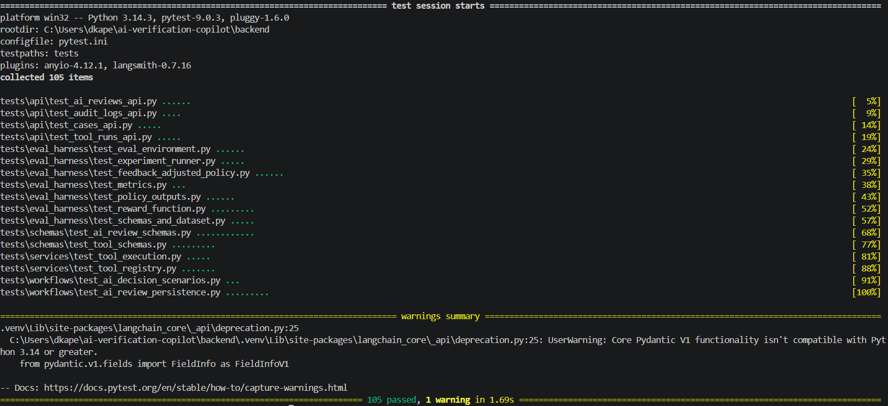
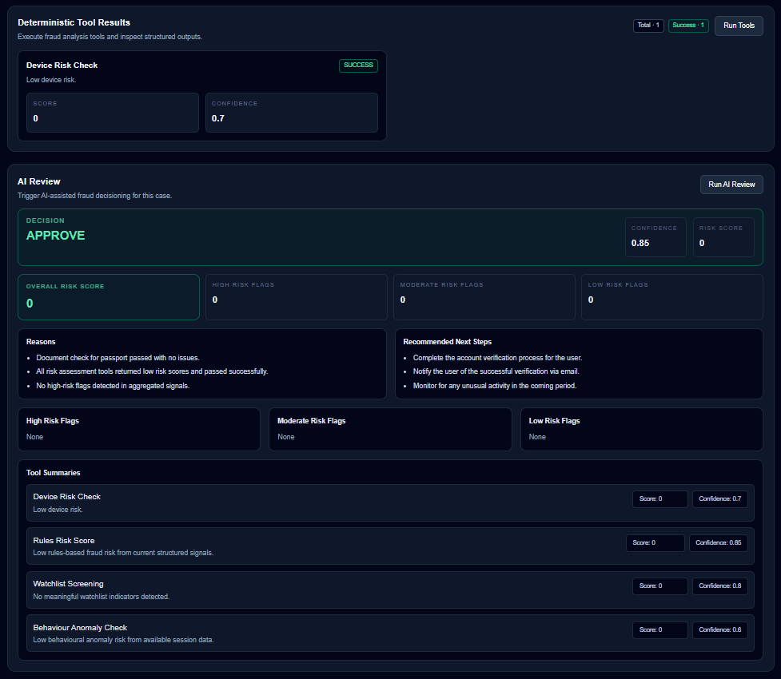
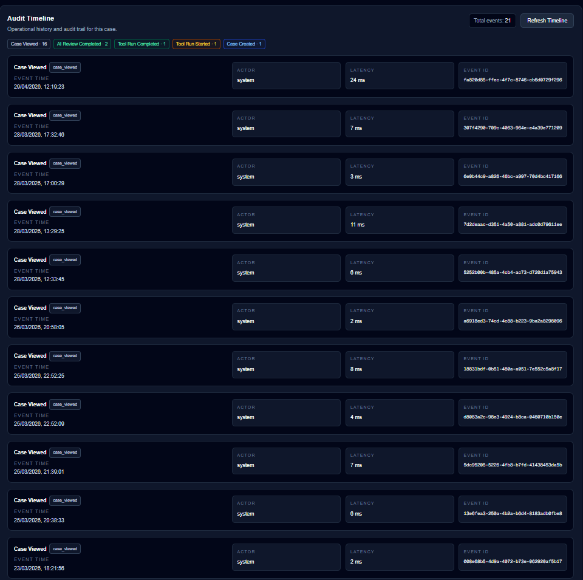
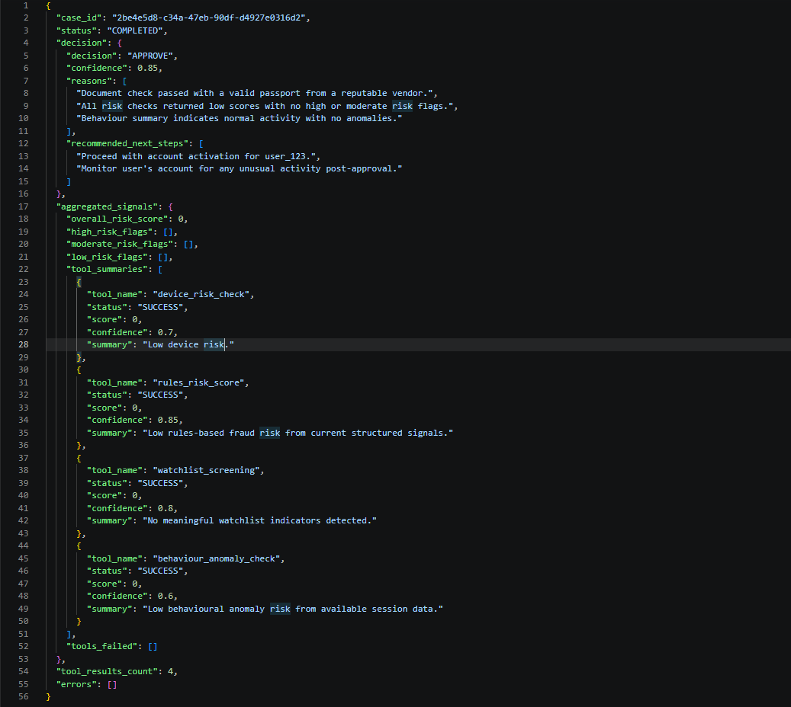
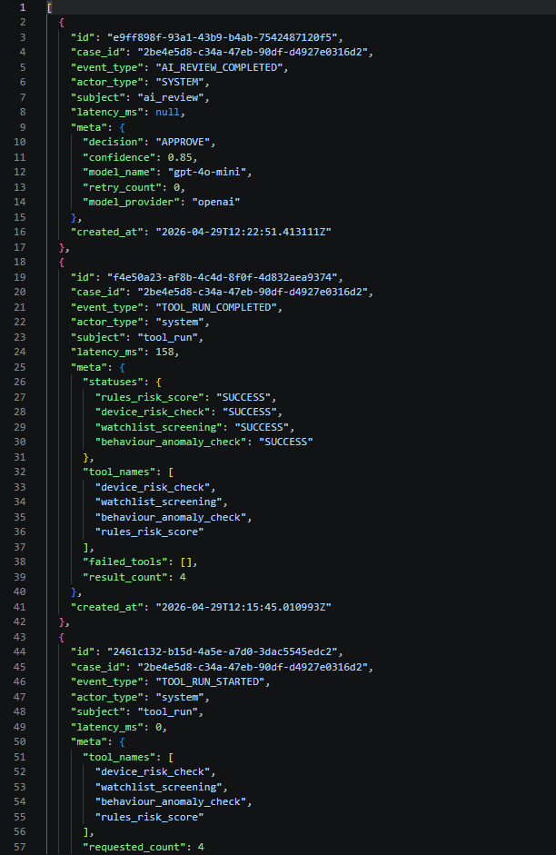
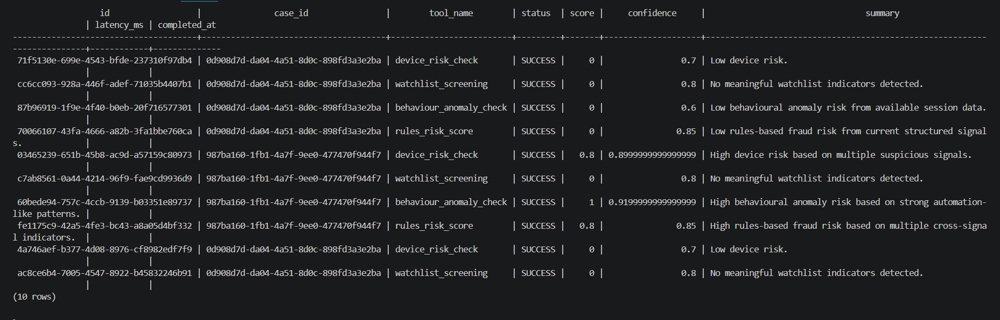
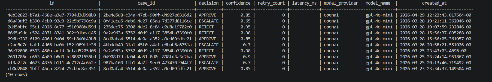
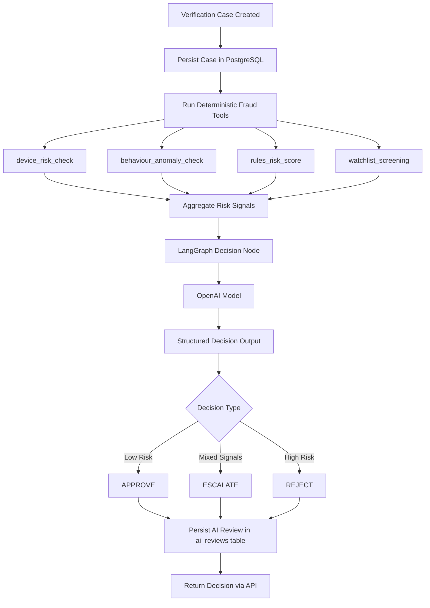
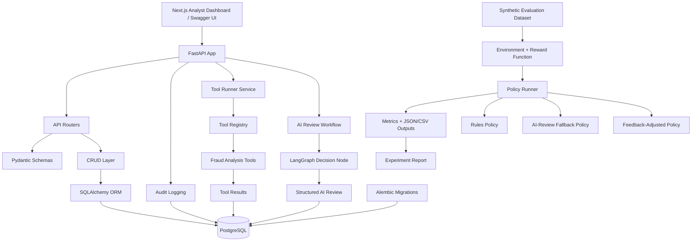

# AI Verification Copilot

**AI Verification Copilot** is a full-stack internal fraud triage and decisioning system that simulates how identity verification, fraud operations, and trust & safety teams review suspicious verification cases.

The project is designed to demonstrate **backend engineering, applied AI systems engineering, persistence, auditability, testing, and internal-tool product thinking**. It is not just a model prompt demo; it is a testable workflow system with API contracts, deterministic tools, persisted state, structured AI outputs, and analyst-facing UI evidence.

## Project at a glance

AI Verification Copilot allows an analyst to:

- browse persisted verification cases
- open a case detail page
- inspect structured device, document, and behaviour signals
- run deterministic fraud checks
- run a LangGraph-based AI review workflow
- inspect structured `APPROVE`, `ESCALATE`, or `REJECT` decisions
- reload latest persisted tool results and AI reviews
- view an audit timeline
- see a human override placeholder workflow

## What this demonstrates

This project is intentionally built to show production-minded engineering patterns:

- FastAPI backend with versioned REST APIs
- PostgreSQL persistence with SQLAlchemy ORM models
- Alembic migration-based schema management
- Pydantic request / response validation
- deterministic fraud tooling with a registry pattern
- parallel async tool execution
- persisted tool runs and AI reviews
- LangGraph AI orchestration
- structured AI decision outputs
- audit logging with metadata and latency
- lightweight learning-from-feedback evaluation harness
- seeded policy comparison experiments
- reward scoring and decision-quality metrics
- JSON/CSV experiment outputs for reproducible evaluation
- pytest coverage for API, schema, service, workflow, persistence, and evaluation behavior
- Next.js analyst dashboard with persisted workflow state

## Current implementation

The current system includes:

- FastAPI backend
- PostgreSQL database
- SQLAlchemy ORM models
- Alembic migrations
- deterministic fraud tools
- tool registry and service-layer orchestration
- LangGraph AI review workflow
- OpenAI API integration
- structured AI review persistence
- audit logging
- latency metadata
- Next.js / TypeScript / Tailwind dashboard
- case queue and case detail pages
- tool results, AI review, audit timeline, and human override panels
- pytest suite covering API contracts, schema validation, mocked AI review workflows, latest-state retrieval, and audit persistence
- lightweight learning-from-feedback evaluation harness with synthetic cases, reward scoring, seeded experiment runs, baseline/AI-review/feedback-adjusted policy comparison, and JSON/CSV experiment outputs
- screenshot evidence for tests, API responses, database tables, and frontend workflows

---

## Architecture overview

The system uses a layered architecture:

- **API layer:** FastAPI exposes versioned REST endpoints and OpenAPI documentation.
- **Schema layer:** Pydantic validates request and response contracts.
- **Persistence layer:** SQLAlchemy maps cases, tool runs, AI reviews, and audit logs to PostgreSQL.
- **Migration layer:** Alembic tracks database schema changes.
- **Tooling layer:** deterministic fraud tools run through a registry and return structured outputs.
- **AI orchestration layer:** LangGraph aggregates deterministic signals and produces structured AI review decisions.
- **Audit layer:** important workflow events are persisted with actor, metadata, timestamp, and latency fields.
- **Frontend layer:** Next.js renders an internal analyst dashboard that reloads persisted workflow state.
- **Evaluation layer:** synthetic cases, reward scoring, policy comparison, seeded experiment runs, and JSON/CSV outputs for measuring decision behavior.

The frontend currently supports:

- `/cases` — analyst case queue
- `/cases/[id]` — case detail workflow
- deterministic tool execution
- latest persisted tool result retrieval
- AI review execution
- latest persisted AI review retrieval
- audit timeline rendering
- human override placeholder workflow

The evaluation harness runs as a separate backend-side Python workflow. It does not depend on the live frontend or a live OpenAI call during tests. It uses synthetic cases and deterministic policy logic so experiments can be reproduced locally.

---

## System workflow

1. A verification case is created through the API.
2. The case is persisted in PostgreSQL.
3. Deterministic fraud tools execute in parallel.
4. Tool outputs are stored in the `tool_runs` table.
5. Signals are aggregated into a risk summary.
6. LangGraph runs the AI review workflow.
7. The AI review produces a structured `APPROVE`, `ESCALATE`, or `REJECT` decision.
8. The decision is persisted in the `ai_reviews` table.
9. Audit events are written for case, tool, and AI workflow actions.
10. The frontend reloads latest persisted tool results, AI reviews, and audit history.

This workflow is designed to resemble internal trust & safety and identity verification systems where deterministic checks, model-assisted review, persistence, and auditability all operate together.

---

## Testing and validation

The backend includes a targeted pytest suite covering API behavior, schema validation, deterministic tooling, mocked AI review workflows, persistence, and audit logging.

Automated tests currently cover:

- case creation, retrieval, pagination, and structured `404` responses
- audit log retrieval and audit event creation
- deterministic tool execution and latest persisted tool result retrieval
- tool registry behavior and service-layer orchestration
- Pydantic validation for tool and AI review outputs
- mocked AI review endpoint behavior without live OpenAI calls
- `APPROVE`, `ESCALATE`, and `REJECT` workflow-style scenarios
- latest persisted AI review retrieval
- AI review persistence, retry metadata, model metadata, latency metadata, and completed/failed audit events
- sanitised provider failure messages for authentication, rate limit, timeout, and connection errors

The automated test suite avoids live OpenAI API calls by default. AI review behavior is tested with controlled mocked outputs so the suite can run reliably without provider credentials.

The latest captured local full backend run shows `105 passed` tests, including `40 passed` tests for the evaluation harness.

---

## Learning from Feedback Evaluation Harness

This extension adds a lightweight learning-from-feedback evaluation harness for testing how fraud review policies perform when decisions receive synthetic outcome feedback.

The harness treats each synthetic verification case as an environment state, each review decision as an action, and the downstream case outcome as a reward signal. It compares deterministic rules, an AI-review policy interface with deterministic offline fallback, and a feedback-adjusted threshold policy using measurable decision-quality metrics.

This phase extends the project beyond a single AI review workflow into a more serious applied AI systems artifact. It introduces evaluation design, policy comparison, feedback-loop awareness, reproducible experiments, reward scoring, and documented limitations.

This is **not** intended to be a frontier reinforcement learning system. The dataset is synthetic, the feedback-adjusted policy is intentionally simple, and the purpose is to show how decision workflows can be evaluated, stress-tested, and adjusted from outcome feedback over time.

Current harness components include:

- synthetic JSONL evaluation dataset
- environment/state/action/reward abstraction
- deterministic reward function with asymmetric fraud-review costs
- baseline rules policy
- AI-review policy interface with offline deterministic fallback
- feedback-adjusted threshold policy
- seeded experiment runner
- JSON and CSV experiment outputs
- metrics for accuracy, average reward, false approvals, false rejections, escalation rate, and decision distribution
- experiment report with assumptions, results, limitations, and next steps
- pytest coverage for schemas, dataset loading, environment behavior, reward calculation, policy outputs, feedback updates, metrics, and experiment reproducibility

Example seeded run results are documented in `backend/experiments/README.md`.

### Seeded policy comparison

The table below shows one small seeded synthetic run using:

- episodes: `25`
- seed: `42`
- dataset: synthetic JSONL verification cases
- sampling: cases sampled with replacement

| Policy | Accuracy | Avg reward | False approve rate | False reject rate | Escalation rate |
|---|---:|---:|---:|---:|---:|
| Rules baseline | `0.84` | `0.70` | `0.00` | `0.16` | `0.12` |
| AI-review fallback | `0.84` | `0.70` | `0.00` | `0.16` | `0.12` |
| Feedback-adjusted | `0.96` | `0.82` | `0.00` | `0.04` | `0.24` |

On this small synthetic seeded run, the feedback-adjusted policy improved average reward and reduced false rejects compared with the static rules baseline. It also increased the escalation rate, which is an expected trade-off in fraud and identity review systems where being more cautious can reduce incorrect rejections but increase manual review workload.

The AI-review fallback matched the rules baseline in this run because it used deterministic offline fallback logic rather than live model calls or saved AI review outputs. This keeps the experiment reproducible and avoids requiring external provider credentials during evaluation.

---

## Demo evidence

The repository includes screenshot evidence for automated tests, frontend workflows, API behavior, and database persistence.

### Backend test suite

Pytest coverage for API endpoints, schema validation, deterministic tool execution, mocked AI review workflows, latest persisted-state retrieval, decision scenarios, and AI review persistence/audit behavior.



### Frontend analyst workflow

The dashboard simulates an internal analyst console for reviewing cases, running fraud tools, viewing AI decisions, inspecting audit history, and seeing the human override path.






Additional frontend screenshots are available in `images/frontend/`.

### API workflow evidence

The FastAPI backend exposes endpoints for case management, deterministic tool execution, AI review, latest-state retrieval, audit logs, and the human override placeholder.






Additional API screenshots are available in `images/api/` and `images/errors/`.

### Database persistence evidence

PostgreSQL persists verification cases, tool runs, AI reviews, and audit logs so workflow state can be reloaded after refresh or local service restart.





Additional database screenshots are available in `images/database/`.

---

## Data Model

### **`cases`**

Stores a verification case under review.

Fields include:

- `id` (UUID)
- `user_id`
- `email`
- `device_info` (JSONB)
- `document_check_result` (JSONB)
- `behaviour_summary` (JSONB)
- `status`
- `created_at`
- `updated_at`

### **`audit_logs`**

Stores backend and workflow events for traceability and operational visibility.

Fields include:

- `id` (UUID)
- `case_id` (nullable)
- `event_type`
- `actor_type`
- `subject`
- `latency_ms`
- `meta` (JSONB)
- `created_at`

### **`tool_runs`**

Stores the results of deterministic risk tools executed against a verification case.

Fields include:

- `id` (UUID)
- `case_id`
- `tool_name`
- `status`
- `score`
- `confidence`
- `summary`
- `signals` (JSONB)
- `output` (JSONB)
- `error_message`
- `latency_ms`
- `started_at`
- `completed_at`

### **`ai_reviews`**

Stores structured AI review outputs generated by the LangGraph-based review workflow.

Fields include:

- `id` (UUID)
- `case_id`
- `decision`
- `confidence`
- `reasons` (JSONB)
- `recommended_next_steps` (JSONB)
- `aggregated_signals` (JSONB)
- `reasoning_summary`
- `model_provider`
- `model_name`
- `prompt_version`
- `retry_count`
- `latency_ms`
- `created_at`

---

## Tech Stack

### **Backend**

- Python
- FastAPI
- Pydantic / `pydantic-settings`
- SQLAlchemy
- Alembic
- Uvicorn

### **Database**

- PostgreSQL
- Docker

### **Frontend**

- Next.js
- TypeScript
- Tailwind CSS
- App Router

### **AI / Orchestration**

- LangGraph
- OpenAI API
- structured AI review outputs
- optional Ollama fallback

## Local Development

### **Prerequisites**

- Python 3.11+
- Node.js 18+
- Docker Desktop
- Git
- VS Code recommended

### **Startup sequence**

Start the local stack in the following order.

### **1) Start PostgreSQL**

```bash
docker start ai_copilot_postgres
```

### **2) Start the backend**

From the `backend/` folder:

```bash
python -m uvicorn app.main:app --reload --host 0.0.0.0 --port 8000
```

The backend should be available at:

- `http://localhost:8000`
- Swagger docs: `http://localhost:8000/docs`

### **3) Start the frontend**

From the `frontend/` folder:

```bash
npm run dev
```

The frontend should be available at:

- `http://localhost:3000`

### **Frontend local environment**

Set the following local frontend environment variable:

```
NEXT_PUBLIC_API_BASE_URL=http://localhost:8000
```

Place it in:

```bash
frontend/.env.local
```

### **Local CORS note**

For local development, the backend CORS configuration explicitly allows common local frontend origins such as:

- `http://localhost:3000`
- `http://127.0.0.1:3000`
- `http://localhost:3001`
- `http://127.0.0.1:3001`

This keeps local development flexible while avoiding wildcard CORS as the default.

---

## API endpoints

### Case workflows

- `POST /api/v1/cases` — create a verification case
- `GET /api/v1/cases` — list persisted cases with pagination
- `GET /api/v1/cases/{case_id}` — retrieve a case by ID

### Tooling and AI review

- `POST /api/v1/cases/{case_id}/run-tools` — run deterministic fraud tools
- `GET /api/v1/cases/{case_id}/tool-runs` — retrieve latest persisted tool results
- `POST /api/v1/cases/{case_id}/ai-review` — run the AI review workflow
- `GET /api/v1/cases/{case_id}/ai-reviews/latest` — retrieve latest persisted AI review
- `GET /api/v1/cases/{case_id}/audit-logs` — retrieve audit history
- `POST /api/v1/cases/{case_id}/human-override` — current human override placeholder

---

## Roadmap

### **1) Repo setup + development workflow**

- [x] Monorepo structure
- [x] Backend, frontend, and database runnable locally

### **2) Backend foundation**

- [x] FastAPI backend
- [x] PostgreSQL persistence
- [x] SQLAlchemy models
- [x] Alembic migrations
- [x] Audit logging
- [x] Pagination and `404` handling

### **3) Tooling layer**

- [x] Shared tool output schema
- [x] `tool_runs` persistence model
- [x] Deterministic fraud checks
- [x] Tool registry
- [x] Parallel tool execution
- [x] Tool execution API endpoint

### **4) AI orchestration**

- [x] LangGraph workflow
- [x] Structured AI review output
- [x] Decision persistence
- [x] Retry handling for invalid structured output

### **5) Frontend dashboard**

- [x] Case list view
- [x] Case detail view
- [x] Deterministic tool outputs
- [x] AI review panel
- [x] Audit timeline
- [x] Human override placeholder workflow
- [x] UI polish and reusable primitives
- [x] Persisted operational state loading on refresh
- [x] Local API configuration cleanup
- [x] Local CORS tightening
- [x] `APPROVE` / `ESCALATE` / `REJECT` paths verified through the UI
- [x] Restart / regression pass completed
- [ ] Full human override persistence
- [ ] Additional mobile / tablet UX refinement

### **6) Testing and validation**

- [x] FastAPI endpoint tests
- [x] structured `404` and pagination tests
- [x] deterministic tool execution tests
- [x] tool registry and service-layer tests
- [x] Pydantic schema validation tests
- [x] mocked AI review endpoint tests without live OpenAI calls
- [x] `APPROVE` / `ESCALATE` / `REJECT` workflow scenario tests
- [x] AI review persistence and audit tests

### **7) Learning from feedback evaluation harness**

- [x] Synthetic fraud evaluation dataset
- [x] Expected decision labels and synthetic outcome metadata
- [x] Environment/state/action/reward abstraction
- [x] Deterministic baseline policy
- [x] AI-review policy interface with offline deterministic fallback
- [x] Feedback-adjusted policy
- [x] Seeded experiment runner
- [x] JSON and CSV experiment outputs
- [x] Metrics for accuracy, average reward, false approvals, false rejections, escalation rate, and decision distribution
- [x] Experiment report and failure analysis
- [x] Pytest coverage for schemas, environment, reward function, policies, metrics, and experiment runner
- [ ] Larger synthetic scenario set
- [ ] Multi-seed aggregate experiment report
- [ ] Expanded benchmarking and coverage analysis

### **8) Production-minded polish**

- [ ] Full Docker Compose stack
- [ ] `.env.example`
- [ ] Logging improvements
- [ ] Better developer onboarding

### **9) Deployment and portfolio packaging**

- [ ] Hosted backend
- [ ] Hosted frontend
- [ ] Hosted PostgreSQL
- [ ] Demo video
- [ ] Evaluation write-up

## Current status

**Project status:** Ongoing  
**Current phase:** Post-dashboard hardening, portfolio packaging, and evaluation harness expansion

Completed:

- FastAPI backend with versioned case, tool, AI review, audit log, and human override endpoints
- PostgreSQL persistence for cases, tool runs, AI reviews, and audit logs
- deterministic fraud tooling with registry-based parallel execution
- LangGraph AI review workflow with structured decisions and persistence
- Next.js analyst dashboard with case queue, case detail, tool results, AI review, audit timeline, and human override placeholder
- pytest coverage for API contracts, schema validation, deterministic tooling, mocked AI review workflows, persistence, and audit behavior
- screenshot evidence for tests, API responses, database tables, and frontend workflows
- lightweight learning-from-feedback evaluation harness with synthetic cases, reward scoring, baseline/AI-review/feedback-adjusted policies, seeded experiment outputs, and pytest coverage

In progress / planned:

- larger synthetic evaluation scenarios and multi-seed experiment reporting
- fuller human override persistence
- tighter frontend/backend response-shape alignment
- `.env.example` files
- onboarding documentation polish
- deployment planning

---

## Architecture diagrams

The README includes Mermaid diagrams for the overall system architecture and AI decision pipeline. These diagrams show how the Next.js frontend, FastAPI backend, PostgreSQL persistence layer, deterministic tooling, audit logging, and LangGraph AI review workflow fit together.

---

## AI Decision Pipeline

The AI decision engine follows a multi-stage workflow that combines deterministic fraud analysis tools with LLM-assisted review.

Each verification case is first analysed by deterministic fraud detection tools. The aggregated risk signals are then passed to an AI review node, which produces a structured outcome.

1. A verification case is loaded from PostgreSQL.
2. Deterministic fraud analysis tools execute in parallel.
3. Structured tool outputs are aggregated into risk signals.
4. The aggregated signals are passed to an LLM review node.
5. The LLM returns a structured decision (`APPROVE`, `ESCALATE`, or `REJECT`).
6. The decision is validated using Pydantic schemas.
7. The result is persisted to the `ai_reviews` table.

This helps keep the AI layer **auditable, explainable, and reproducible**.


---

## Local Smoke Test

A quick manual smoke test for the current dashboard:

1. Start Docker PostgreSQL
2. Start the backend
3. Start the frontend
4. Open `/cases`
5. Open a case detail page
6. Run deterministic tools
7. Run AI review
8. Refresh the page and confirm the latest persisted tool results still appear
9. Refresh the page and confirm the latest persisted AI review still appears
10. Refresh the audit timeline and confirm recent activity is shown

The dashboard has been manually validated across all three decision paths:

- **APPROVE**
- **ESCALATE**
- **REJECT**

A restart / regression pass has also been completed to confirm that persisted tool runs, persisted AI reviews, and audit timeline history remain available after restarting Docker, the backend, and the frontend.

Demo cases for `APPROVE`, `ESCALATE`, and `REJECT` are available in `backend/demo_cases/`.

---

## Known limitations / technical debt

The project is working end to end, but several areas are intentionally still being hardened or extended:

- frontend types still need tighter alignment with exact backend response shapes
- shared UI primitives for loading, error, and empty states still need to be applied consistently
- mobile and tablet support for the queue can be improved further
- nested JSON rendering can become more analyst-friendly over time
- audit event grouping and collapsing can be refined further for very long timelines
- the human override workflow is still a placeholder and is not yet fully persisted end to end
- `.env.example` files still need to be added
- local developer onboarding can be improved further
- the evaluation harness currently uses a small synthetic dataset and simple threshold adjustment rather than real fraud labels, online learning, or a trained reinforcement learning policy

---

## Overall Architecture Diagram

The system is designed as a full-stack internal review platform with a persisted backend workflow, an analyst-facing frontend dashboard, and a separate evaluation harness for policy comparison experiments.

The frontend calls the FastAPI backend, which coordinates CRUD operations, deterministic fraud tooling, AI review orchestration, and audit logging. Operational state is persisted in PostgreSQL so the dashboard can reload the latest tool results, AI reviews, and audit history.

The evaluation harness runs separately from the main application flow. It uses synthetic cases, deterministic reward scoring, policy runners, and JSON/CSV outputs to compare review-policy behavior in a reproducible way.



## Future Direction

The next major improvements are likely to include:

- expanded synthetic evaluation scenarios
- multi-seed benchmarking and aggregate experiment reporting
- evaluation of saved AI review outputs against expected outcomes
- richer reward models for fraud loss, customer friction, and manual review workload
- fuller human override persistence
- additional frontend architecture cleanup
- stronger onboarding documentation
- `.env.example` support
- deployment and portfolio packaging

This project is intended to bring together backend engineering, applied AI systems design, realistic internal-tool product thinking, and early learning-from-feedback evaluation in a single end-to-end workflow.
