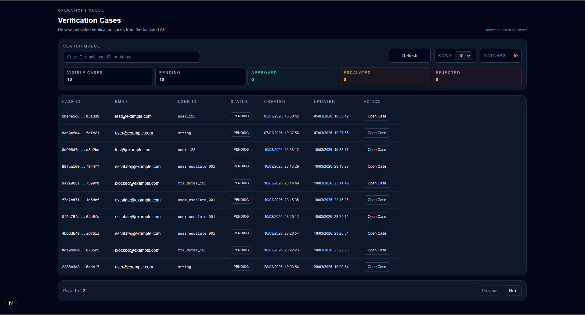
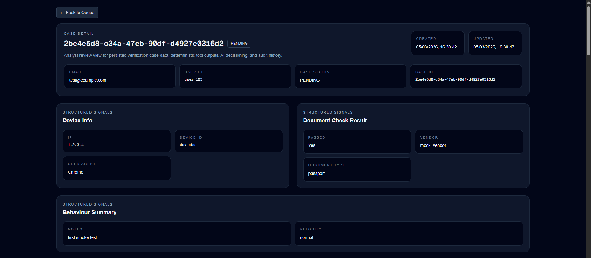
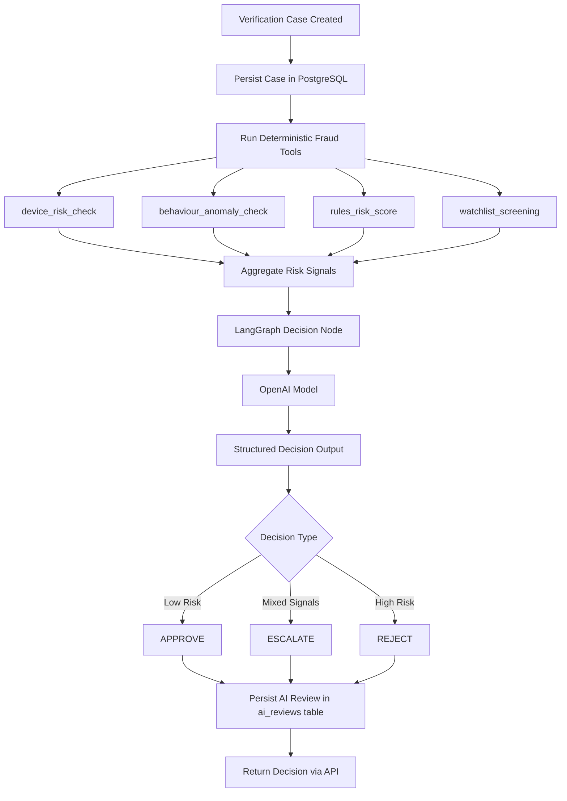
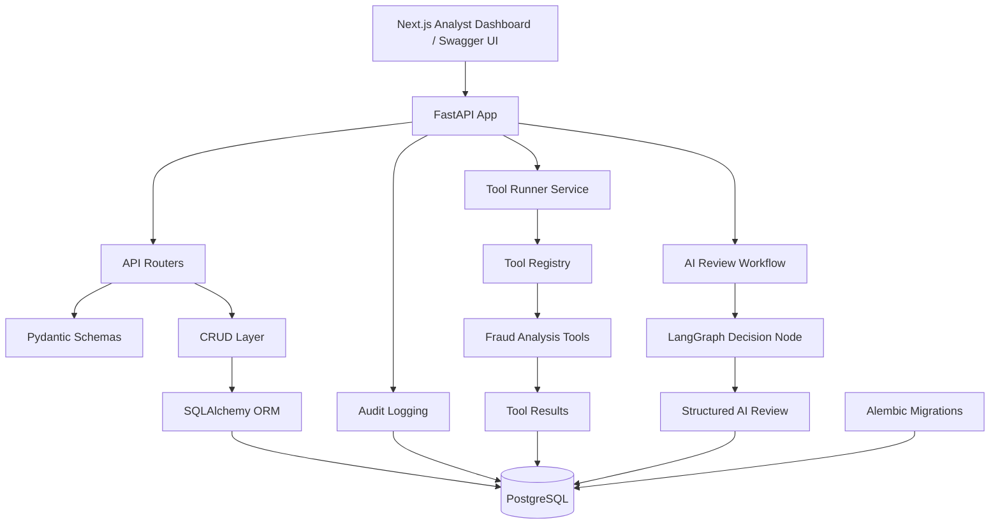

# AI Verification Copilot

**AI Verification Copilot** is a production-style internal fraud triage and decisioning system designed to simulate the kind of tooling used by identity verification, fraud operations, and trust & safety teams to review potentially suspicious verification cases.

This project is intentionally designed to demonstrate **applied AI systems engineering and backend/product engineering patterns**, not just simple model prompting. It is a full-stack engineering portfolio project focused on structured tool execution, orchestration, persistence, auditability, explainability, and human-in-the-loop workflow design.

The goal is to build something that feels like a realistic internal analyst tool, where:

- verification cases are persisted
- deterministic fraud tools run against those cases
- AI review outputs are structured and persisted
- audit history is captured
- the frontend behaves like an internal review console
- the system can later support evaluation, benchmarking, and fuller human override workflows

The current implementation includes:

- a working FastAPI backend
- PostgreSQL persistence
- SQLAlchemy ORM models
- Alembic migrations
- paginated case APIs
- structured audit logging
- deterministic fraud tooling with parallel execution
- LangGraph-based AI orchestration
- structured AI decision persistence
- a working Next.js frontend dashboard
- persisted tool result retrieval
- persisted AI review retrieval
- audit timeline rendering in the frontend
- a human override placeholder workflow
- reproducible demo cases covering `APPROVE`, `ESCALATE`, and `REJECT`

---

## Backend Architecture

The backend follows a layered architecture to keep routing, validation, persistence, workflow logic, and auditability clearly separated. This makes the system easier to reason about, extend, and test as the project grows.

### **API Layer**

FastAPI exposes the HTTP interface, defines versioned endpoints, and provides automatic OpenAPI documentation for local development and testing.

### **Schema Layer**

Pydantic models handle request validation and response serialisation so API contracts remain explicit and structured.

### **CRUD Layer**

Database operations are separated into CRUD functions to keep route handlers thin and reduce coupling between API logic and persistence logic.

### **Persistence Layer**

SQLAlchemy ORM maps Python models to PostgreSQL tables and supports persisted operational state across cases, tool runs, AI reviews, and audit events.

### **Migration Layer**

Alembic manages schema evolution through version-controlled migrations so database changes remain traceable and repeatable.

### **Audit Layer**

Audit events are written to `audit_logs` to capture backend actions, workflow metadata, and latency for traceability and operational visibility.

### **Tool Execution Layer**

Deterministic fraud tools execute against structured case data and return standardised outputs that can be persisted, reviewed, and reused by downstream workflow steps.

### **AI Review Layer**

A LangGraph-based orchestration flow aggregates deterministic tool signals and produces structured AI review outputs that are validated and persisted for later retrieval, audit, and evaluation.

---

## Frontend Dashboard

The project includes a working internal-style analyst dashboard built with **Next.js**, **TypeScript**, and **Tailwind CSS**.

The frontend is designed to simulate a realistic internal review console where an analyst can:

- browse verification cases
- open a case detail page
- inspect structured case data
- run deterministic fraud tools
- run an AI review
- inspect aggregated signals and explainability
- view audit history
- see a human override placeholder workflow

### **Current frontend routes**

- `/cases` — verification case queue
- `/cases/[id]` — case detail page

### **Current frontend capabilities**

- paginated queue view
- search and filter on the queue
- refresh action
- rows-per-page selector
- internal-tool styling
- case metadata rendering
- device info, document check, and behaviour summary panels
- deterministic tool results panel
- AI review panel
- audit timeline panel
- human override placeholder panel
- persisted operational state loading on refresh

---

## System Workflow

The current system processes verification cases using the following workflow:

1. A verification case is created through the API.
2. The case is persisted in PostgreSQL.
3. Deterministic fraud analysis tools execute in parallel.
4. Each tool returns structured risk signals.
5. Tool results are stored in the `tool_runs` table.
6. Aggregated signals are passed into a LangGraph-based AI review workflow.
7. The AI review node produces a structured outcome (`APPROVE`, `ESCALATE`, or `REJECT`).
8. The result is persisted to the `ai_reviews` table and returned via the API.
9. Audit events are written for important workflow actions.
10. The frontend dashboard can reload the latest persisted tool results and latest persisted AI review for a case.
11. Audit history can be viewed in the case detail screen.

This workflow is designed to reflect the structure of internal trust & safety and identity verification systems, where deterministic checks and model-assisted review operate together within a persisted, auditable workflow.

---

## Testing and validation

The backend includes a targeted pytest suite covering API contracts, structured error handling, persistence, schema validation, deterministic tool execution, AI review workflows, and audit behavior.

Automated tests currently cover:

- case creation, retrieval, pagination, and structured missing-case responses
- audit log retrieval and audit event creation
- deterministic fraud tool execution and latest persisted tool result retrieval
- tool registry behavior and service-layer tool orchestration
- Pydantic validation for deterministic tool inputs and outputs
- Pydantic validation for structured AI review outputs
- approve, escalate, and reject workflow-style scenarios using controlled mocked AI outputs
- AI review endpoint behavior without live OpenAI calls
- latest persisted AI review retrieval
- AI review persistence, retry metadata, model metadata, latency metadata, and completed/failed audit events
- sanitized provider failure messages for authentication, rate limit, timeout, and connection errors

The automated test suite avoids live OpenAI API calls by default. AI review paths are tested with controlled mocked outputs so the suite can run reliably without external provider credentials.

---

## Data Model

### **`cases`**

Stores a verification case under review.

Fields include:

- `id` (UUID)
- `user_id`
- `email`
- `device_info` (JSONB)
- `document_check_result` (JSONB)
- `behaviour_summary` (JSONB)
- `status`
- `created_at`
- `updated_at`

### **`audit_logs`**

Stores backend and workflow events for traceability and operational visibility.

Fields include:

- `id` (UUID)
- `case_id` (nullable)
- `event_type`
- `actor_type`
- `subject`
- `latency_ms`
- `meta` (JSONB)
- `created_at`

### **`tool_runs`**

Stores the results of deterministic risk tools executed against a verification case.

Fields include:

- `id` (UUID)
- `case_id`
- `tool_name`
- `status`
- `score`
- `confidence`
- `summary`
- `signals` (JSONB)
- `output` (JSONB)
- `error_message`
- `latency_ms`
- `started_at`
- `completed_at`

### **`ai_reviews`**

Stores structured AI review outputs generated by the LangGraph-based review workflow.

Fields include:

- `id` (UUID)
- `case_id`
- `decision`
- `confidence`
- `reasons` (JSONB)
- `recommended_next_steps` (JSONB)
- `aggregated_signals` (JSONB)
- `reasoning_summary`
- `model_provider`
- `model_name`
- `prompt_version`
- `retry_count`
- `latency_ms`
- `created_at`

---

## Tech Stack

### **Backend**

- Python
- FastAPI
- Pydantic / `pydantic-settings`
- SQLAlchemy
- Alembic
- Uvicorn

### **Database**

- PostgreSQL
- Docker

### **Frontend**

- Next.js
- TypeScript
- Tailwind CSS
- App Router

### **AI / Orchestration**

- LangGraph
- OpenAI API
- structured AI review outputs
- optional Ollama fallback

## Local Development

### **Prerequisites**

- Python 3.11+
- Node.js 18+
- Docker Desktop
- Git
- VS Code recommended

### **Startup sequence**

Start the local stack in the following order.

### **1) Start PostgreSQL**

```bash
docker start ai_copilot_postgres
```

### **2) Start the backend**

From the `backend/` folder:

```bash
python -m uvicorn app.main:app --reload --host 0.0.0.0 --port 8000
```

The backend should be available at:

- `http://localhost:8000`
- Swagger docs: `http://localhost:8000/docs`

### **3) Start the frontend**

From the `frontend/` folder:

```bash
npm run dev
```

The frontend should be available at:

- `http://localhost:3000`

### **Frontend local environment**

Set the following local frontend environment variable:

```
NEXT_PUBLIC_API_BASE_URL=http://localhost:8000
```

Place it in:

```bash
frontend/.env.local
```

### **Local CORS note**

For local development, the backend CORS configuration explicitly allows common local frontend origins such as:

- `http://localhost:3000`
- `http://127.0.0.1:3000`
- `http://localhost:3001`
- `http://127.0.0.1:3001`

This keeps local development flexible while avoiding wildcard CORS as the default.
---

## Roadmap

### **1) Repo setup + development workflow**

- [x] Monorepo structure
- [x] Backend, frontend, and database runnable locally

### **2) Backend foundation**

- [x] FastAPI backend
- [x] PostgreSQL persistence
- [x] SQLAlchemy models
- [x] Alembic migrations
- [x] Audit logging
- [x] Pagination and `404` handling

### **3) Tooling layer**

- [x] Shared tool output schema
- [x] `tool_runs` persistence model
- [x] Deterministic fraud checks
- [x] Tool registry
- [x] Parallel tool execution
- [x] Tool execution API endpoint

### **4) AI orchestration**

- [x] LangGraph workflow
- [x] Structured AI review output
- [x] Decision persistence
- [x] Retry handling for invalid structured output

### **5) Frontend dashboard**

- [x] Case list view
- [x] Case detail view
- [x] Deterministic tool outputs
- [x] AI review panel
- [x] Audit timeline
- [x] Human override placeholder workflow
- [x] UI polish and reusable primitives
- [x] Persisted operational state loading on refresh
- [x] Local API configuration cleanup
- [x] Local CORS tightening
- [x] `APPROVE` / `ESCALATE` / `REJECT` paths verified through the UI
- [x] Restart / regression pass completed
- [ ] Full human override persistence
- [ ] Additional mobile / tablet UX refinement

### **6) Evaluation harness**

- [ ] Synthetic fraud dataset
- [ ] Expected decision labels
- [ ] Accuracy and decision metrics
- [ ] Latency monitoring
- [ ] Coverage analysis

### **7) Production-minded polish**

- [ ] Full Docker Compose stack
- [ ] `.env.example`
- [ ] Logging improvements
- [ ] Better developer onboarding

### **8) Deployment and portfolio packaging**

- [ ] Hosted backend
- [ ] Hosted frontend
- [ ] Hosted PostgreSQL
- [ ] Demo video
- [ ] Evaluation write-up

## Current Status

**Project status:** Ongoing

**Current phase:** Evaluation harness planning and post-dashboard hardening

### **Completed so far**

- Repo setup and local development workflow

- Backend foundation
  - FastAPI API
  - PostgreSQL persistence
  - SQLAlchemy ORM models
  - Alembic migrations
  - Pydantic request and response schemas
  - CRUD case workflows
  - audit logging
  - pagination
  - `404` handling
  - latency instrumentation

- Tooling layer
  - structured tool result schemas
  - tool registry pattern
  - deterministic fraud checks
  - parallel tool execution
  - tool execution API endpoint
  - persisted tool run retrieval

- AI orchestration layer
  - LangGraph workflow
  - structured AI review outputs
  - decision persistence (`ai_reviews`)
  - retry handling for invalid structured output
  - `APPROVE` / `ESCALATE` / `REJECT` demo scenarios
  - persisted latest AI review retrieval

- Frontend dashboard
  - case queue page
  - case detail page
  - deterministic tool results panel
  - AI review panel
  - audit timeline
  - human override placeholder
  - persisted latest tool results loading on refresh
  - persisted latest AI review loading on refresh
  - queue density and responsiveness improvements
  - detail header polish
  - shared frontend API configuration cleanup
  - local CORS tightening for local development
  - shared formatting helpers
  - shared status badge helper
  - shared stat card primitive
  - `APPROVE` / `ESCALATE` / `REJECT` paths validated through the UI
  - restart / regression pass completed successfully

### **In progress**

- evaluation harness design
- frontend and backend response-shape alignment
- frontend architecture notes and developer onboarding improvements
- full human override persistence design
- optional mobile and tablet UX refinement

---

## Demo Evidence

The repository includes screenshot evidence for automated tests, API workflows, database persistence, frontend analyst workflows, and architecture diagrams.

### Backend Test Suite

Pytest coverage for API endpoints, structured errors, pagination, audit logging, deterministic tool execution, schema validation, mocked AI review workflows, persisted latest-state retrieval, approve / escalate / reject scenarios, and AI review persistence/audit behavior.


### Frontend Analyst Workflow

The frontend dashboard simulates an internal analyst console for reviewing verification cases, running deterministic fraud tools, viewing AI review decisions, and inspecting audit history.






### API Workflow Evidence

The FastAPI backend exposes versioned endpoints for case management, deterministic tool execution, AI review, persisted latest-state retrieval, and audit history.


### Database Persistence Evidence

PostgreSQL stores verification cases, deterministic tool runs, AI reviews, and audit logs so the system can reload workflow state after refresh or local service restart.


### Architecture Evidence

The README includes Mermaid diagrams for the overall system architecture and AI decision pipeline. These diagrams show how the frontend, FastAPI backend, PostgreSQL persistence layer, deterministic tooling, audit logging, and LangGraph AI review workflow fit together.

## AI Decision Engine (Agent Orchestration)

Phase 4 introduces an **AI decision engine** built with **LangGraph** that orchestrates deterministic fraud tools, aggregates structured signals, and produces validated, structured AI review outcomes.

Rather than calling a model directly, the system follows a multi-stage workflow designed to resemble the review flow used in internal fraud and verification platforms.

---

## AI Decision Pipeline

The AI decision engine follows a multi-stage workflow that combines deterministic fraud analysis tools with LLM-assisted review.

Each verification case is first analysed by deterministic fraud detection tools. The aggregated risk signals are then passed to an AI review node, which produces a structured outcome.

1. A verification case is loaded from PostgreSQL.
2. Deterministic fraud analysis tools execute in parallel.
3. Structured tool outputs are aggregated into risk signals.
4. The aggregated signals are passed to an LLM review node.
5. The LLM returns a structured decision (`APPROVE`, `ESCALATE`, or `REJECT`).
6. The decision is validated using Pydantic schemas.
7. The result is persisted to the `ai_reviews` table.

This helps keep the AI layer **auditable, explainable, and reproducible**.


---

## Example AI Review Outcomes

The system currently demonstrates three representative verification scenarios.

Example case inputs and AI review outputs are available in the repository:

[`backend/demo_cases/`](https://github.com/dkapesa/AI-Verification-Copilot/tree/master/backend/demo_cases)

Each scenario includes:

- the **case request payload** sent to the API
- the **AI review response** returned by the decision engine

Files included:

- `approve_case_request.json`
- `approve_ai_review.json`
- `escalate_case_request.json`
- `escalate_ai_review.json`
- `reject_case_request.json`
- `reject_ai_review.json`

### **Low-Risk Approval**

A case with:

- valid document verification
- no watchlist matches
- low device risk
- normal behavioural signals

### **Decision**

**Decision:** `APPROVE`  
**Confidence:** `0.90`

### **Reasoning**

- Document verification passed with no fraud indicators
- Low overall risk score
- No moderate- or high-risk flags
- All deterministic tools reported low risk

### **Next Steps**

- Proceed with account activation
- Continue passive monitoring for unusual behaviour

---

### **Mixed-Signal Escalation**

A case containing:

- emulator device signals
- VPN / proxy detection
- high automation behaviour patterns
- repeated verification attempts

### **Decision**

**Decision:** `ESCALATE`  
**Confidence:** `0.65`

### **Reasoning**

- High device risk based on multiple suspicious signals
- Behavioural anomaly patterns consistent with automation
- Repeated verification attempts suggest suspicious activity

### **Next Steps**

- Manual fraud analyst review
- Additional identity verification
- Account activity monitoring

---

### **High-Risk Fraud Rejection**

A case containing:

- failed document verification
- flagged user identifiers
- disposable / blocked email
- rooted emulator device
- network obfuscation
- automation-like behaviour patterns

### **Decision**

**Decision:** `REJECT`  
**Confidence:** `0.99`

### **Reasoning**

- Document verification failed
- Watchlist match detected
- Multiple high-risk fraud indicators were present
- Behaviour patterns strongly suggest automation

### **Next Steps**

- Block the account
- Alert fraud operations
- Record indicators for future detection

---

## AI Decision Persistence

AI review outputs are stored in the `ai_reviews` table for auditability, later retrieval, and downstream evaluation.

Fields include:

- `case_id`
- `decision`
- `confidence`
- `reasons`
- `recommended_next_steps`
- `aggregated_signals`
- `model_provider`
- `model_name`
- `latency_ms`
- `created_at`

This supports:

- post-decision auditing
- evaluation and benchmarking
- human override workflows
- model performance analysis

---

## Why this project exists

Many portfolio AI projects focus on model calls in isolation. This project takes a more production-minded approach.

The goal is to build a realistic internal system that:

- persists verification cases
- runs deterministic risk checks before model-assisted review
- records audit trails
- supports structured AI review outputs
- enables human review and override workflows
- exposes explainability and aggregated signals
- can later be evaluated against synthetic case datasets

---

## Core Features Implemented

### **Backend API**

- `POST /api/v1/cases` — create a verification case
- `GET /api/v1/cases` — list persisted cases with pagination
- `GET /api/v1/cases/{case_id}` — retrieve a case by ID

### **Tool Execution and Review Workflow**

- `POST /api/v1/cases/{case_id}/run-tools` — execute deterministic fraud analysis tools against a case
- `GET /api/v1/cases/{case_id}/tool-runs` — fetch the latest persisted tool results for a case
- `POST /api/v1/cases/{case_id}/ai-review` — run the LangGraph-based AI review workflow
- `GET /api/v1/cases/{case_id}/ai-reviews/latest` — fetch the latest persisted AI review for a case
- `GET /api/v1/cases/{case_id}/audit-logs` — fetch persisted audit history for a case
- `POST /api/v1/cases/{case_id}/human-override` — placeholder endpoint for the current human override workflow

### **Frontend Dashboard**

- `/cases` — analyst case queue
- `/cases/[id]` — case detail page
- persisted case list rendering
- search and pagination
- deterministic tool results panel
- AI review panel
- audit timeline panel
- human override placeholder panel

### **Deterministic Risk Tooling**

The system includes a modular tooling layer capable of executing multiple fraud detection tools in parallel.

Currently implemented tools include:

- `behaviour_anomaly_check`
- `device_risk_check`
- `rules_risk_score`
- `watchlist_screening`

Each tool returns structured results including:

- risk score
- confidence level
- summary explanation

The system uses a **tool registry pattern** to dynamically discover and execute tools without hardcoding them in API endpoints.

Parallel execution allows the system to scale as new tools are added while keeping latency low.

---

### **Example Tool Execution Response**

Example response from:

`POST /api/v1/cases/{case_id}/run-tools`

```json
{
  "case_id":"2be4e5d8-c34a-47eb-90df-d4927e0316d2",
  "results": [
    {
      "tool_name":"behaviour_anomaly_check",
      "status":"SUCCESS",
      "score":0,
      "confidence":0.6,
      "summary":"Low behavioural anomaly risk from available session data."
    },
    {
      "tool_name":"device_risk_check",
      "status":"SUCCESS",
      "score":0,
      "confidence":0.7,
      "summary":"Low device risk."
    },
    {
      "tool_name":"rules_risk_score",
      "status":"SUCCESS",
      "score":0,
      "confidence":0.85,
      "summary":"Low rules-based fraud risk from current structured signals."
    },
    {
      "tool_name":"watchlist_screening",
      "status":"SUCCESS",
      "score":0,
      "confidence":0.8,
      "summary":"No matches found in watchlist screening."
    }
  ]
}
```

### **Persistence & Data Modeling**

- PostgreSQL database running locally in Docker
- SQLAlchemy ORM models for:
    - `cases`
    - `audit_logs`
    - `tool_runs`
    - `ai_reviews`
- Alembic migration-based schema management

### **Reliability & Observability**

- structured audit logging for key backend actions
- latency tracking for selected API operations
- pagination for list endpoints
- proper `404` handling for missing cases
- OpenAPI / Swagger docs for local testing
- persisted audit trail for tool and AI workflows

## Key Engineering Patterns

This project intentionally demonstrates several backend and applied AI engineering patterns commonly used in production-minded systems:

- **Layered Architecture**  
  Separates API routing, validation, persistence, workflow logic, and tooling concerns.

- **Registry Pattern**  
  The tool registry allows new fraud detection tools to be added without modifying API endpoints.

- **Service Layer Pattern**  
  Tool execution and workflow logic are separated from the API layer to keep endpoints thinner and easier to maintain.

- **Structured Tool Outputs**  
  All tools return standardised result objects to simplify downstream aggregation, persistence, and analysis.

- **Parallel Execution**  
  Fraud tools run concurrently to reduce latency as the number of checks grows.

- **Persistence-First Operational State**  
  Tool results, AI reviews, and audit activity are persisted so the frontend can reload the latest operational state instead of depending only on in-memory or per-session browser state.

---

## Current Frontend Working Behaviour

The dashboard has moved beyond a proof-of-concept state and now supports a more realistic analyst workflow with persisted operational state.

### **Queue page**

The `/cases` page currently supports:

- persisted case loading from the backend
- internal-style queue layout
- case ID / email / user ID / status columns
- created and updated timestamps
- search and filter
- pagination
- rows-per-page selection
- refresh action
- improved density and interaction polish

### **Case detail page**

The `/cases/[id]` page currently supports:

- polished case metadata header
- created and updated timestamps in the header
- device info rendering
- document check result rendering
- behaviour summary rendering
- back-to-queue navigation
- more structured rendering of simple top-level fields

### **Deterministic Tool Results panel**

The tool results panel currently supports:

- on-demand tool execution
- latest persisted tool result loading on refresh
- status display
- score display
- confidence display
- summary display
- richer persisted details where available
- expandable detail views for additional persisted tool output
- loading and error handling

### **AI Review panel**

The AI review panel currently supports:

- on-demand AI review execution
- latest persisted AI review loading on refresh
- decision rendering
- confidence rendering
- reasons
- recommended next steps
- aggregated signals
- overall risk score
- risk flag counts
- risk flag lists
- tool summaries
- reasoning summary display when returned

### **Audit timeline**

The audit timeline currently supports:

- persisted audit log retrieval
- grouped event counts
- event timeline rendering
- case, tool, and AI workflow events
- metadata rendering in a more analyst-friendly format
- refresh action

### **Human override panel**

The human override panel currently supports:

- visible human-in-the-loop workflow placeholder
- reviewer decision input
- reviewer note input
- clearer placeholder workflow framing
- submit action against the current stub endpoint

---

## Local Smoke Test

A quick manual smoke test for the current dashboard:

1. Start Docker PostgreSQL
2. Start the backend
3. Start the frontend
4. Open `/cases`
5. Open a case detail page
6. Run deterministic tools
7. Run AI review
8. Refresh the page and confirm the latest persisted tool results still appear
9. Refresh the page and confirm the latest persisted AI review still appears
10. Refresh the audit timeline and confirm recent activity is shown

The dashboard has been manually validated across all three decision paths:

- **APPROVE**
- **ESCALATE**
- **REJECT**

A restart / regression pass has also been completed to confirm that persisted tool runs, persisted AI reviews, and audit timeline history remain available after restarting Docker, the backend, and the frontend.

Commonly used development test cases have included:

- `0d908d7d-da04-4a51-8d0c-898fd3a3e2ba`
- `8cd0afa4-5514-4c0a-a352-a9ed09fdfc21`
- `9a2a963a-5752-40d9-a117-3854ba7390f0`
- `8f41eca5-4ab6-4c27-85aa-7d377d8116ce`

---

## Known Limitations / Technical Debt

The project is working end to end, but several areas are intentionally still being hardened or extended:

- frontend types still need tighter alignment with exact backend response shapes
- shared UI primitives for loading, error, and empty states still need to be applied consistently
- mobile and tablet support for the queue can be improved further
- nested JSON rendering can become more analyst-friendly over time
- audit event grouping and collapsing can be refined further for very long timelines
- the human override workflow is still a placeholder and is not yet fully persisted end to end
- `.env.example` files still need to be added
- local developer onboarding can be improved further
- the evaluation harness and benchmarking workflow are the next major phase

---

## Overall Architecture Diagram

The system is designed as a full-stack internal review platform with a persisted backend workflow and an analyst-facing frontend dashboard.

The frontend calls the FastAPI backend, which coordinates CRUD operations, deterministic fraud tooling, AI review orchestration, and audit logging. Operational state is persisted in PostgreSQL so the dashboard can reload the latest tool results, AI reviews, and audit history.



## Future Direction

The next major improvements are likely to include:

- a synthetic evaluation harness
- expected decision labels and benchmarking
- fuller human override persistence
- additional frontend architecture cleanup
- stronger onboarding documentation
- `.env.example` support
- deployment and portfolio packaging

This project is intended to bring together backend engineering, applied AI systems design, and realistic internal-tool product thinking in a single end-to-end workflow.
