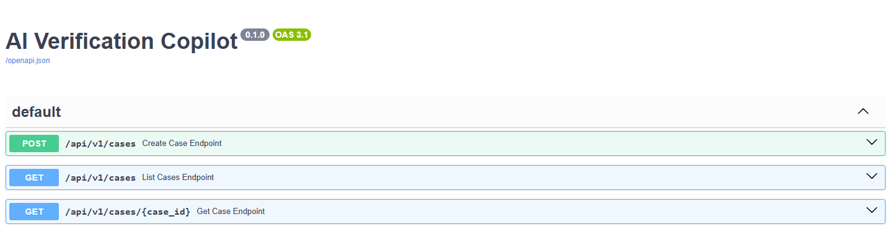
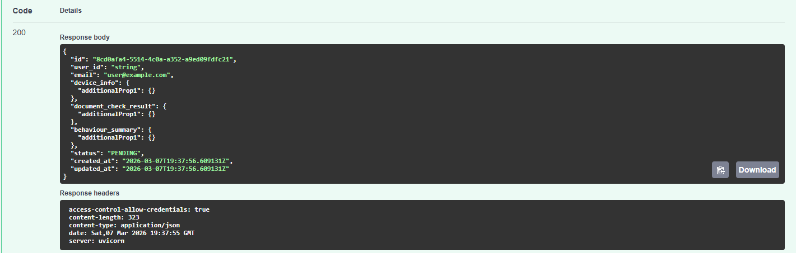
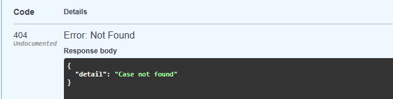
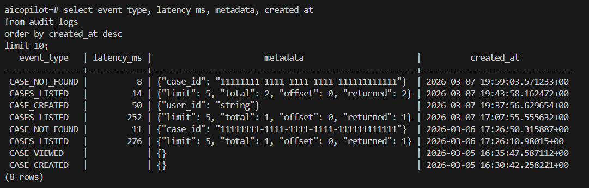
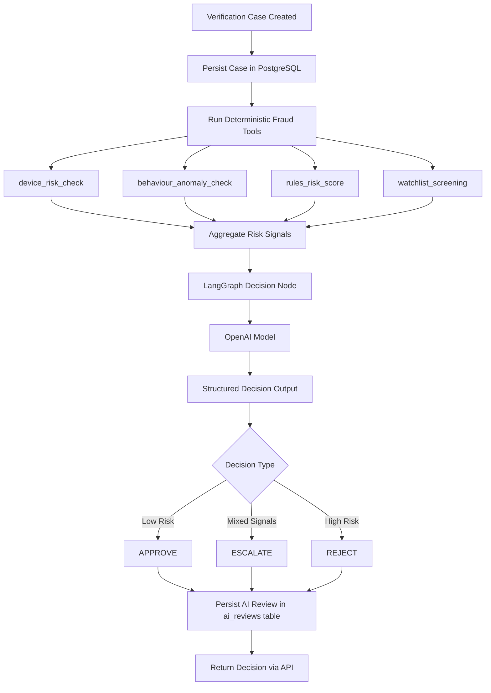

# AI Verification Copilot

**AI Verification Copilot** is a production-style internal fraud triage and decisioning system designed to simulate the type of tooling used by identity verification and trust & safety teams to review potentially suspicious verification cases.

The project is being built as a full-stack engineering portfolio piece with a strong focus on backend systems, structured tool execution, agent-based orchestration, human-in-the-loop workflows, auditability, and evaluation discipline.

The current implementation includes:

- a working FastAPI backend
- PostgreSQL persistence
- SQLAlchemy ORM models
- Alembic migrations
- paginated case APIs
- structured audit logging
- a deterministic fraud tooling layer capable of executing multiple risk analysis tools in parallel

The current implementation now includes deterministic fraud tooling, LangGraph-based AI orchestration, structured decision persistence, and reproducible demo cases covering approve, escalate, and reject outcomes.

---

## Backend Architecture

The current backend is designed using a layered architecture so that each part of the system remains independently understandable, testable, and extensible.

### **API Layer**

FastAPI provides the HTTP interface and automatic OpenAPI documentation.

### **Schema Layer**

Pydantic models define request validation and response serialisation.

### **CRUD Layer**

Database access is separated into CRUD functions to keep route handlers thin and maintainable.

### **Persistence Layer**

SQLAlchemy ORM maps Python models to PostgreSQL tables.

### **Migration Layer**

Alembic manages database schema evolution through version-controlled migrations.

### **Audit Layer**

Audit events are written to `audit_logs` to capture backend actions, metadata, and latency.

## System Workflow

The current system processes verification cases using the following workflow:

1. A verification case is created through the API.
2. The case is persisted in PostgreSQL.
3. Risk analysis tools can be executed for the case.
4. Each tool produces structured risk signals.
5. Tool results are stored in the `tool_runs` table.
6. The API returns aggregated tool results for review.

This workflow forms the foundation for the upcoming agent orchestration layer, which will automatically interpret tool results and produce risk decisions.

---

## Data Model

### **`cases`**

Represents a verification case under review.

Fields include:

- `id` (UUID)
- `user_id`
- `email`
- `device_info` (JSONB)
- `document_check_result` (JSONB)
- `behaviour_summary` (JSONB)
- `status` (`PENDING`, `REVIEWED`, `ESCALATED`)
- `created_at`
- `updated_at`

### **`audit_logs`**

Stores backend and workflow events for observability and traceability.

Fields include:

- `id` (UUID)
- `case_id` (nullable)
- `event_type`
- `actor_type`
- `subject`
- `latency_ms`
- `metadata` (JSONB)
- `created_at`

### **`tool_runs`**

Stores the results of deterministic risk tools executed against a verification case.

Fields include:

- `id` (UUID)
- `case_id`
- `tool_name`
- `status`
- `score`
- `confidence`
- `summary`
- `signals` (JSONB)
- `output` (JSONB)
- `error_message`
- `latency_ms`
- `started_at`
- `completed_at`
  
---

## Tech Stack

### **Backend**

- Python
- FastAPI
- Pydantic / pydantic-settings
- SQLAlchemy
- Alembic
- Uvicorn

### **Database**

- PostgreSQL
- Docker / Docker Compose

### **Frontend (planned)**

- Next.js
- TypeScript
- Tailwind

### **AI / Orchestration**

- LangGraph
- OpenAI API
- structured decision outputs
- optional Ollama fallback

---

## Local Development

### **Prerequisites**

- Python 3.11+
- Node.js 18+
- Docker Desktop
- Git
- VS Code recommended

---

## Roadmap

### **1) Repo setup + dev workflow**

- [x]  Monorepo structure
- [x]  Backend, frontend, and database runnable locally

### **2) Backend foundation**

- [x]  FastAPI backend
- [x]  PostgreSQL persistence
- [x]  SQLAlchemy models
- [x]  Alembic migrations
- [x]  Audit logging
- [x]  Pagination and 404 handling

### **3) Tooling layer**

- [x]  Shared tool output schema
- [x]  `tool_runs` persistence model
- [x]  Deterministic fraud checks
- [x]  Tool registry
- [x]  Parallel tool execution
- [x]  Tool execution API endpoint

### 4) Agent orchestration

- [x] LangGraph workflow
- [x] Structured AI review output
- [x] Decision persistence
- [x] Retry on invalid structured output

### **5) Frontend dashboard**

- [ ] Case list view
- [ ] Case detail view
- [ ] Deterministic tool outputs
- [ ] AI review panel
- [ ] Human override workflow

### **6) Evaluation harness**

- [ ] Synthetic fraud dataset
- [ ] Expected decision labels
- [ ] Accuracy / decision metrics
- [ ] Latency monitoring
- [ ] Coverage analysis

### **7) Production polish**

- [ ]  Full Docker Compose stack
- [ ]  `.env.example`
- [ ]  Logging improvements
- [ ]  Better developer onboarding

### **8) Deployment + portfolio packaging**

- [ ]  Hosted backend
- [ ]  Hosted frontend
- [ ]  Hosted Postgres
- [ ]  Demo video
- [ ]  Evaluation write-up

## Current Status

**Project status:** Ongoing  
**Current phase:** Frontend dashboard

### Completed so far
- Repo setup + local development workflow
- Backend foundation
  - FastAPI API
  - PostgreSQL persistence
  - SQLAlchemy ORM models
  - Alembic migrations
  - Pydantic request/response schemas
  - CRUD case workflows
  - audit logging
  - pagination
  - 404 handling
  - latency instrumentation

- Tooling layer
  - structured tool result schemas
  - tool registry pattern
  - deterministic fraud checks
  - parallel tool execution
  - tool execution API endpoint
 
- Agent orchestration layer
  - LangGraph workflow
  - structured AI review outputs
  - decision persistence (`ai_reviews`)
  - retry handling for invalid structured output
  - approve / escalate / reject demo scenarios

### In progress
- Frontend dashboard
- case review experience
- AI review display and human override workflow

---

## Demo Evidence

### API Overview
Swagger/OpenAPI overview of the current backend foundation, showing the core case management endpoints.



### Successful Case Creation
Successful case creation through the FastAPI API, returning a persisted verification case with generated UUID, status, and timestamps.



### 404 Error Handling
Missing-case lookup returning a structured `404` response instead of an internal server error.



### Audit Logging
Audit log query showing backend events, latency measurements, and structured metadata captured during case workflows.



---

## AI Decision Engine (Agent Orchestration)

Phase 4 introduces an **AI decision engine** built using **LangGraph** that orchestrates fraud analysis tools, aggregates risk signals, and produces a structured AI decision.

Instead of calling a model directly, the system follows a multi-stage workflow similar to what internal fraud platforms use.

---

## AI Decision Pipeline

The AI decision engine follows a multi-stage workflow combining deterministic fraud analysis tools with LLM-based reasoning.

Each verification case is first analysed by deterministic fraud detection tools.  
The aggregated risk signals are then passed to an AI decision node which produces a structured outcome.

1. A verification case is loaded from PostgreSQL.
2. Deterministic fraud analysis tools execute in parallel.
3. Structured tool outputs are aggregated into risk signals.
4. The aggregated signals are passed to an LLM decision node.
5. The LLM returns a structured decision (`APPROVE`, `ESCALATE`, or `REJECT`).
6. The decision is validated using Pydantic schemas.
7. The result is persisted to the `ai_reviews` table.

This ensures that the AI layer remains **auditable, explainable, and reproducible**.


---

# Example AI Review Outcomes

The system currently demonstrates three realistic verification scenarios.

Example inputs and AI outputs are available in the repository:

[`backend/demo_cases/`](https://github.com/dkapesa/AI-Verification-Copilot/tree/master/backend/demo_cases)

Each scenario contains:

- the **case request payload** sent to the API
- the **AI review response** returned by the decision engine

Files included:

- `approve_case_request.json`
- `approve_ai_review.json`
- `escalate_case_request.json`
- `escalate_ai_review.json`
- `reject_case_request.json`
- `reject_ai_review.json`

```
```
---

## Low-Risk Approval

A case with:

- valid document verification
- no watchlist matches
- low device risk
- normal behavioural signals

### Decision

**Decision:** `APPROVE`  
**Confidence:** `0.90`

```
```

### Reasoning

- Document check result is valid with no fraud indicators
- Low overall risk score
- No moderate or high risk flags
- All deterministic tools report low risk

### Next Steps

- Proceed with account activation
- Continue passive monitoring for unusual behaviour

---

## Mixed-Signal Escalation

A case containing:

- emulator device signals
- VPN / proxy detection
- high automation behaviour patterns
- repeated verification attempts

### Decision

**Decision:** `ESCALATE`  
**Confidence:** `0.65`
```
```

### Reasoning

- High device risk based on multiple suspicious signals
- Behavioural anomaly patterns consistent with automation
- Multiple verification attempts suggest suspicious activity

### Next Steps

- Manual fraud analyst review
- Additional identity verification
- Account activity monitoring

---

## High-Risk Fraud Rejection

A case containing:

- failed document verification
- flagged user identifiers
- disposable / blocked email
- rooted emulator device
- network obfuscation
- automation-like behaviour patterns

### Decision

**Decision:** `REJECT`  
**Confidence:** `0.99`
```
```

### Reasoning

- Document verification failed
- Watchlist match detected
- Multiple high-risk fraud indicators
- Behaviour patterns strongly suggest automation

### Next Steps

- Block the account
- Alert fraud operations
- Record indicators for future detection

---

# AI Decision Persistence

AI decisions are stored in the `ai_reviews` table for auditability.

Fields include:

- `case_id`
- `decision`
- `confidence`
- `reasons`
- `recommended_next_steps`
- `aggregated_signals`
- `model_provider`
- `model_name`
- `latency_ms`
- `created_at`

This enables:

- post-decision auditing
- evaluation and benchmarking
- human overrides
- model performance analysis

---

## Why this project exists

Most portfolio AI projects jump straight to model calls. This project takes a more production-oriented approach.

The goal is to build a realistic internal system that:
- persists verification cases
- runs deterministic risk checks
- records audit trails
- supports structured AI decisions
- enables human review and override
- can later be evaluated on synthetic case datasets

---

## Core Features Implemented

### Backend API
- `POST /api/v1/cases` — create a verification case
- `GET /api/v1/cases` — list cases with pagination
- `GET /api/v1/cases/{case_id}` — retrieve a case by ID
### Tool Execution
- `POST /api/v1/cases/{case_id}/run-tools` — execute deterministic fraud analysis tools against a case
- Stub routes for:
- `POST /api/v1/cases/{case_id}/ai-review` — run the LangGraph-based AI review workflow
- `POST /api/v1/cases/{case_id}/human-override` — planned
### Deterministic Risk Tooling

The system includes a modular tooling layer capable of executing multiple fraud detection tools in parallel.

Currently implemented tools include:

- `behaviour_anomaly_check`
- `device_risk_check`
- `rules_risk_score`
- `watchlist_screening`

Each tool returns structured results including:

- risk score
- confidence level
- summary explanation

The system uses a **tool registry pattern** to dynamically discover and execute tools without hardcoding them in API endpoints.

Parallel execution allows the system to scale as new tools are added while keeping latency low.

---

### Example Tool Execution Response

Example response from:

`POST /api/v1/cases/{case_id}/run-tools`

```json
{
  "case_id": "2be4e5d8-c34a-47eb-90df-d4927e0316d2",
  "results": [
    {
      "tool_name": "behaviour_anomaly_check",
      "status": "SUCCESS",
      "score": 0,
      "confidence": 0.6,
      "summary": "Low behavioural anomaly risk from available session data."
    },
    {
      "tool_name": "device_risk_check",
      "status": "SUCCESS",
      "score": 0,
      "confidence": 0.7,
      "summary": "Low device risk."
    },
    {
      "tool_name": "rules_risk_score",
      "status": "SUCCESS",
      "score": 0,
      "confidence": 0.85,
      "summary": "Low rules-based fraud risk from current structured signals."
    },
    {
      "tool_name": "watchlist_screening",
      "status": "SUCCESS",
      "score": 0,
      "confidence": 0.8,
      "summary": "No matches found in watchlist screening."
    }
  ]
}
```

### Persistence & Data Modeling
- PostgreSQL database running locally in Docker
- SQLAlchemy ORM models for:
  - `cases`
  - `audit_logs`
- Alembic migration-based schema management

### Reliability & Observability
- Structured audit logging for key backend actions
- Latency tracking for selected API operations
- Pagination for list endpoints
- Proper `404` handling for missing cases
- OpenAPI / Swagger docs for local testing

---

## Key Engineering Patterns

This project intentionally demonstrates several backend engineering patterns commonly used in production systems:

- **Layered Architecture**  
  Separates API routing, business logic, persistence, and tooling layers.

- **Registry Pattern**  
  The tool registry allows new fraud detection tools to be added without modifying API endpoints.

- **Service Layer Pattern**  
  Tool execution logic is separated from the API layer to keep endpoints simple.

- **Structured Tool Outputs**  
  All tools return standardised result objects to simplify aggregation and analysis.

- **Parallel Execution**  
  Fraud tools run concurrently to minimise response latency as the system scales.

---

## Architecture Diagram

```mermaid
flowchart TD
    A[Browser / Swagger UI / Future Frontend] --> B[FastAPI App]

    B --> C[API Routers]
    C --> D[Pydantic Schemas]

    C --> E[CRUD Layer]
    E --> F[SQLAlchemy ORM]
    F --> G[(PostgreSQL)]

    B --> H[Audit Logging]
    H --> G

    B --> I[Tool Runner Service]
    I --> J[Tool Registry]
    J --> K[Fraud Analysis Tools]

    K --> L[Tool Results]
    L --> G

    M[Alembic Migrations] --> G

    N[Future Agent Layer] -.-> I
    N -.-> G
